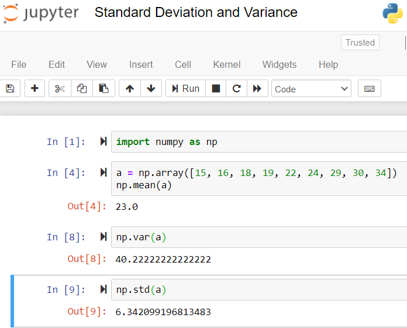

### Machine Learning Sololearn Notes

* Source : [Sololearn](https://www.sololearn.com/learning/1094)

## The Basics

# Welcome to Machine Learning

Machine Learning is a way of taking data and turning it into insights.
We use computer power to analyze examples from the past to build a model that can predict the result for new examples.

- Machine learning models every day : 
   * Netflix recommendations 
   * Amazon Pricing System 
   * credit card company calls based on suspicious activity (anamolous behaviour prediction models)

- Machine Learning can be used to :
   * create a chatbot
   * detect spam 
   * image recognition.

- Approach : 
   * Python (Programming Language)
   * Pandas (library) for reading data and data manipulation
   * Numpy (library) is used for computations of numerical data
   * Matplotlib (library) is used for graphing data
   * scikit-learn (library) is used for machine learning models
   * Basic Statistics

- Types : 
   * Supervised 
   * Unsupervised Learning. 
   
   1. **Supervised learning** is when we have a known target based on past data (for example, predicting what price a house will sell for) 
      * classification 
      * regression problems
   
   2. **Unsupervised learning** is when there isn't a known past answer (for example, determining the topics discussed in restaurant reviews).

- **Regression** is predicting a numerical value (for example, predicting what price a house will sell for) 
- **Classification** is predicting what class something belongs to (for example, predicting if a borrower will default on their loan).

- **Classification problems** are the problems where we’re predicting which class something belongs to.
   * Examples will include:
      * Predicting who would survive the Titanic crash
      * Determining a handwritten digit from an image
      * Using biopsy data to classify if a lump is cancerous

   * Techniques to tackle these classification problems: 
      * Logistic Regression
      * Decision Trees
      * Random Forests
      * Neural Networks

 *Sololearn course will focus on supervised learning and classification.*

 ## Statistics Review

 - Averages
   * The mean is the most commonly known average.
   * The median is the value in the middle. 

   ( If there is an even number of datapoints, to find the median (or 50th percentile), you take the mean of the two values in the middle.)

*In statistics, both the mean and the median are called averages. The layman’s average is the mean.*

- Percentiles

   * The median can also be thought of as the 50th percentile. 
   * The 25th percentile is the value that’s one quarter of the way through the data. This is the value where 25% of the data is less than it (and 75% of the data is greater than it).
   * Similarly, the 75th percentile is three quarters of the way through the data. 

If we look at these ages:
15, 16, 18, 19, 22, 24, 29, 30, 34 

   * 25th percentile is 18 (the 3rd datapoint).
   * 75th percentile is 29 (the 7th datapoint).                          
   * The full range of our data is between 15 and 34. 
   * The 25th and 75th percentiles tell us that half our data is between 18 and 29. 

The percentiles helps us gain understanding of how the data is distributed (or Data Distribution).

- Standard Deviation & Variance

   * Deeper understanding of the distribution of our data with the standard deviation and variance. 
   * The standard deviation and variance are measures of how dispersed or spread out the data is.

- Steps for calculating Standard Deviation and Variance:

   1. We measure how far each datapoint is from the mean.

      ```15, 16, 18, 19, 22, 24, 29, 30, 34```
      
      Recall that the mean is 23.

   2. Let's calculate how far each value is from the mean. 
   
      ```15 is 8 away from the mean (since 23-15=8).```
         Here's a list of all these distances:
         8, 7, 5, 4, 1, 1, 6, 7, 11

   3. We square these values and add them together. Divide this value by the total number of values and that gives us the variance.
         362 / 9 = 40.22 

   4. To get the standard deviation, we just take the square root of this number and get: 6.34

   

### Reading Data with Pandas

* Pandas is a Python module that helps us read and manipulate data. 
* What's cool about pandas is that you can take in data and view it as a table that's human readable, but it can also be interpreted numerically so that you can do lots of computations with it.
* We call the table of data a DataFrame.

- A few useful functions from pandas library:
   1. head() returns first 5 rows
   2. describe() returns a table of statistics about the columns.

- For each column we see a few statistics. Note that it only gives statistics for the numerical columns.
   1. **Count:** This is the number of rows that have a value. 
   2. **Mean:** Recall that the mean is the standard average.
   3. **Std:** This is short for standard deviation. This is a measure of how dispersed the data is.
   4. **Min:** The smallest value
   5. **25%:** The 25th percentile
   6. **50%:** The 50th percentile, also known as the median.
   7. **75%:** The 75th percentile
   8. **Max:** The largest value

- describe() method gives some intuition about the data.

### Manipulating Data with Pandas

1. To select a single column, we use the square brackets and the column name.

   ```python
   col = df['Fare']
   print(col)
   ```

   * Here col object type is Pandas Series
   * A Pandas Series is a single column from a Pandas DataFrame.
   * A series is like a DataFrame, but it's just a single column.

2. When selecting a single column from a Pandas DataFrame, we use single square brackets. When selecting multiple columns, we use double square brackets.

   ```python
   small_df = df[['Age', 'Sex', 'Survived']]
   ```

3. Creating a Column

   1. **Example** : our data has the sex of the passenger as a string ("male" or "female"). This is easy for a human to read, but when we do computations on our data later on, we’ll want it as boolean values (Trues and Falses).
   
   2. We can easily create a new column in our DataFrame that is :
      * **True** if the passenger is **male** 
      * **False** if they’re **female**.

   3. We create a Pandas Series that will be a series of Trues and Falses (True if the passenger is male and False if the passenger is female).

      ```python
      df['Sex'] == 'male'
      ```
   
   4. Now we want to create a column with this result. To create a new column, we use the same bracket syntax (df['male']) and then assign this new value to it.

      ```python
      df['male'] = df['Sex'] == 'male'
      ```
   
   5. The output dataframe will have a new column with boolean values for male.

      ```python
      import pandas as pd
      df = pd.read_csv('https://sololearn.com/uploads/files/titanic.csv')
      df['male'] = df['Sex'] == 'male'
      print(df.head())
      ```

### Numpy Basics

   1. Numpy is a Python package for manipulating lists and tables of numerical data. 
   2. We call the list or table of data a numpy array.
   3. We often will take the data from our pandas DataFrame and put it in numpy arrays. 
   4. **Pandas DataFrames** - human readable. But, not the ideal format for doing calculations. 
   5. **numpy arrays** - less human readable. But, have format to enable the necessary computation.
   6. Numpy is a Python module for doing calculations on tables of data. 
   7. Pandas was actually built using Numpy as it’s foundation.

### Converting from a Pandas Series to a Numpy Array

   * First we recall that we can use the single bracket notation to get a pandas Series of the Fare column as follows.

      ```python
         df['Fare']
      ```

   * Then we use the values attribute to get the values as a numpy array.

      ```python
      df['Fare'].values
      ```

   * The values attribute of a Pandas Series give the data as a numpy array.

### Converting from a Pandas DataFrame to a Numpy Array

   * The values attribute of a Pandas DataFrame give the data as a 2d numpy array.
   * If we have a pandas DataFrame (instead of a Series as in the last part), we can still use the values attribute, but it returns a 2-dimensional numpy array.

      ```python
         df[['Pclass', 'Fare', 'Age']].values 
      ```

### Numpy Shape Attribute

   * We use the numpy **shape** attribute to determine the size of our numpy array. 
   * The size tells us how many rows and columns are in our data.
   * If we look at the shape, we get the number of rows and the number of columns:
      
      ```python
         print(arr.shape) 
      ```

   * You can also use the shape attribute on a pandas DataFrame (df.shape).